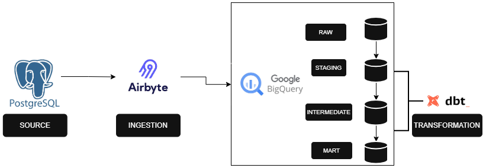
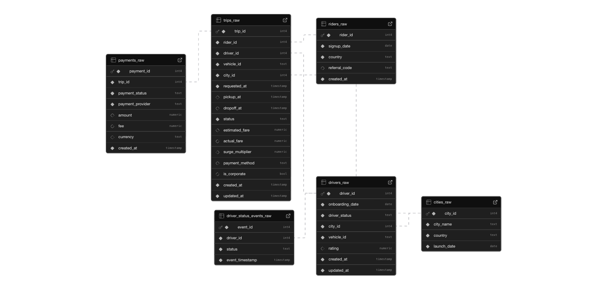
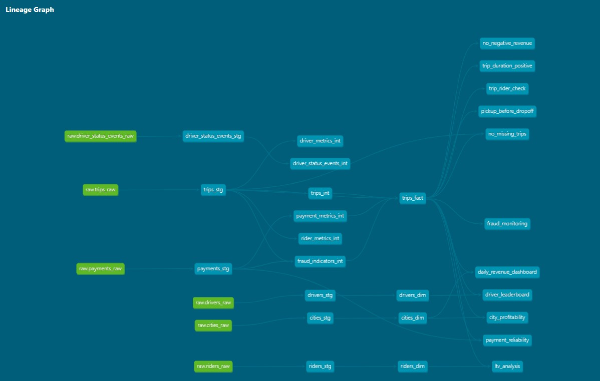

# BeejanRide Analytics Platform with dbt

A production-grade analytics platform built for Beejan Rides, a UK mobility startup operating in 5 cities. The platform transforms raw transactional data—including rides, drivers, riders, payments, and city information—into robust fact and dimension tables ready for analytics dashboards.

---
## Table of Contents

- [Overview](#overview)  
- [Features](#features)  
- [Architecture & Data Flow](#architecture--data-flow)  
- [Data Lineage](#data-lineage)
- [Technologies Used](#technologies-used) 
- [Project Setup](#project-setup)  
  - [Prerequisites](#prerequisites)  
  - [Installation](#installation)  
- [How It Works](#how-it-works)
- [Sample Analytical Queries](#sample-analytical-queries)  
- [Design Decisions & Tradeoffs](#sample-analytical-queries)  
- [Future Enhancements](#future-enhancements)  
- [Useful Resources](#useful-resources)  

---
## **Overview**

This project implements a **scalable dbt analytics platform** for Beejan Rides.  

- Ingests raw transactional data from Postgres via Airbyte.  
- Cleans, deduplicates, and standardizes data in **staging layer**.  
- Computes metrics in **intermediate layer**.  
- Stores data in **fact and dimension tables** in **marts layer**.  

Supports:  
- Daily revenue per city  
- Corporate vs personal revenue split  
- Driver performance & leaderboard  
- Rider lifetime value (LTV)  
- Payment reliability & fraud monitoring  

---

## **Features**

- Raw → Staging → Intermediate → Marts layered approach  
- dbt snapshots for **driver SCD Type 2** (status, vehicle, rating)  
- Incremental models for high-volume tables  
- dbt tests for data quality  
- Documentation & lineage generation via `dbt docs`  
- Analytical queries ready for intelligence dashboards.  

---
## **Architecture & Data Flow**

### **Architecture Diagram**


- **Raw Layer**: Ingested via Airbyte  
- **Staging Layer**: Cleans & deduplicates raw tables  
- **Intermediate Layer**: Computes reusable metrics & fraud flags  
- **Marts Layer**: Creates fact & dimension tables for dashboards  

### **Entity Relationship Diagram (ERD)**
  

### **Data Lineage**
  

### **Data Flow Explanation**

1. **Airbyte ingestion**: postgres → bigquery raw tables  
2. **Staging models**: rename columns, cast data types, standardize timestamps, remove duplicates  
3. **Intermediate models**: calculate key metrics like `trip_duration_minutes`, `net_revenue`, `rider_lifetime_value`  
4. **Marts layer**: ready-to-use fact & dimension tables for BI dashboards  
5. **Snapshots**: track driver changes for SCD Type 2  
6. **dbt docs**: generates lineage & documentation  

---

## **Technologies Used**

- **dbt Core** – Transformations 
- **BigQuery** – Cloud data warehouse  
- **Airbyte** – ETL ingestion from Postgres  
- **Git & GitHub** – Version control  

---
## **Project Setup**

### **Prerequisites**

- BigQuery account and dataset  
- Airbyte configured for ingestion  
- Python 3.11  
- dbt installed  

### **Installation**
Follow these steps to set up the Beejan Rides analytics project on your local machine:

1. Clone the Repository
```bash
git clone https://github.com/adetanchelsea/beejanrides_analytics.git
cd beejanrides_analytics
```
This will copy all models, snapshots, macros, analyses, and documentation to your local machine.

2. Create and activate a virtual environment
```bash
python -m venv venv && source venv/bin/activate    # Mac/Linux
venv\Scripts\activate # Windows
```

3. Install dbt and dependencies
```bash
pip install dbt-core dbt-bigquery
dbt deps
```
4. Configure environment variables: Create a .env file in the project root
```bash
BIGQUERY_PROJECT=your_project_id
BIGQUERY_DATASET=dbt_dataset
BIGQUERY_KEYFILE=path/to/service-account.json
```

5. Configure your dbt profile: Create a profiles.yml file in .dbt
```yaml
beejan_rides:
  target: dev
  outputs:
    dev:
      type: bigquery
      method: service-account
      project: your_project_id
      dataset: dbt_dataset
      keyfile: path/to/service-account.json
      threads: 4
```

6. Run the pipeline
```bash
dbt run
dbt test
dbt docs generate
dbt docs serve
```
This will build all staging, intermediate, and marts models and generate the dbt documentation and lineage graph.

## How It Works  
1. Data Ingestion via Airbyte: Airbyte pulls data from Postgres (raw transactional data) and loads it into BigQuery for further processing.

2. Staging Layer: Cleans, deduplicates, and standardizes raw data (e.g., renaming columns, casting timestamps) to prepare for analysis.

3. Intermediate Layer: Computes key metrics and flags, such as fraud detection, extreme surge multipliers, and failed payments for deeper insights.

4. Marts Layer: Creates fact and dimension tables, structured in a star schema, for use in dashboards and analytical queries.

5. Snapshots: Tracks SCD Type 2 changes (e.g., driver status updates) to maintain historical accuracy.

6. Testing & Documentation: Implements dbt tests (data validation), and generates dbt docs for model lineage and governance.

## Sample Analytical Queries  
### Daily Revenue Dashboard
```sql
select
    date(t.pickup_at) as trip_date,
    c.city_name,
    count(t.trip_id) as total_trips,
    sum(t.actual_fare) as gross_revenue,
    sum(t.net_revenue) as net_revenue,
    avg(t.actual_fare) as avg_trip_fare

from {{ ref('trips_fact') }} as t
left join {{ ref('cities_dim') }} as c
    on t.city_id = c.city_id

group by
    date(t.pickup_at),
    c.city_name

order by
    trip_date,
    c.city_name
```
### Rider LTV Analysis
```sql
select

r.rider_id,

min(t.pickup_at) as first_trip_date,

max(t.pickup_at) as last_trip_date,

count(t.trip_id) as lifetime_trips,

sum(t.net_revenue) as lifetime_value,

avg(t.actual_fare) as avg_trip_value,

date_diff(max(t.pickup_at), min(t.pickup_at), day) as rider_lifespan_days

from {{ ref('trips_fact') }} t
left join {{ ref('riders_dim') }} r
on t.rider_id = r.rider_id

group by
r.rider_id

order by
lifetime_value desc
```

### Fraud Monitoring
```sql
select

trip_id,

driver_id,

rider_id,

city_id,

surge_multiplier,

actual_fare,

extreme_surge_multiplier,

failed_payment_on_completed_trip,

case

when extreme_surge_multiplier = 1
then 'Extreme Surge Pricing'

when failed_payment_on_completed_trip = 1
then 'Failed Payment on Completed Trip'

else 'Normal'

end as fraud_flag

from {{ ref('trips_fact') }}

where

extreme_surge_multiplier = 1
or failed_payment_on_completed_trip = 1
```

## Design Decisions & Tradeoffs  
1. Layered architecture: Easier maintenance, testing, and modularity.

2. dbt snapshots: Track historical changes without rewriting entire tables.

3. Incremental models: Faster runs for high-volume tables.

### Tradeoffs:

Incremental Append Sync Mode

Pros:

1. Efficient: Only new or updated data is processed, reducing execution time and costs.

2. Cost-Effective: Minimizes data processed, saving on BigQuery query costs.

3. Scalable: Handles large datasets effectively without performance hits.

Cons:

1. Complex: Requires additional logic to handle missing or historic data.

2. Data Consistency: Must ensure incremental logic prevents duplicates or outdated records.

## Future Enhancements  
1. Use Airflow or dbt Cloud to automate the execution of dbt models, ensuring data transformations run on a schedule (e.g., daily/weekly).on a schedule (e.g., daily/weekly).

2. Integrate predictive models for driver churn and fraud detection to enhance decision-making with machine learning insights.

3. Connect the BigQuery data warehouse to Tableau or Looker Studio for real-time, interactive business intelligence dashboards.

## Useful Resources  
- [dbt documentation](https://docs.getdbt.com/)
- [Airbyte documentation](https://docs.airbyte.com/)
- [Create a Data Modelling Pipeline](https://youtu.be/Nro18RmwE6E?si=iuhcJsaFDDPonMQA)
