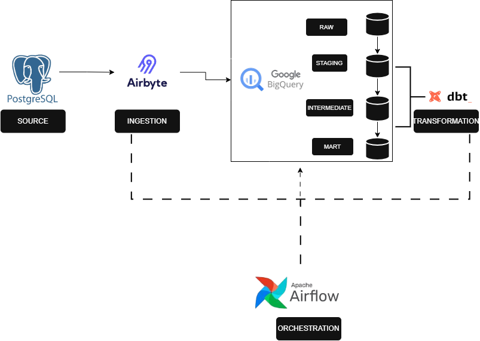
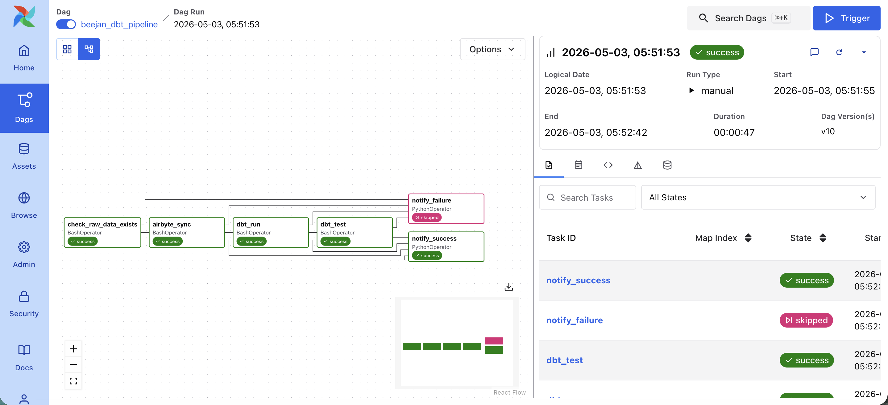
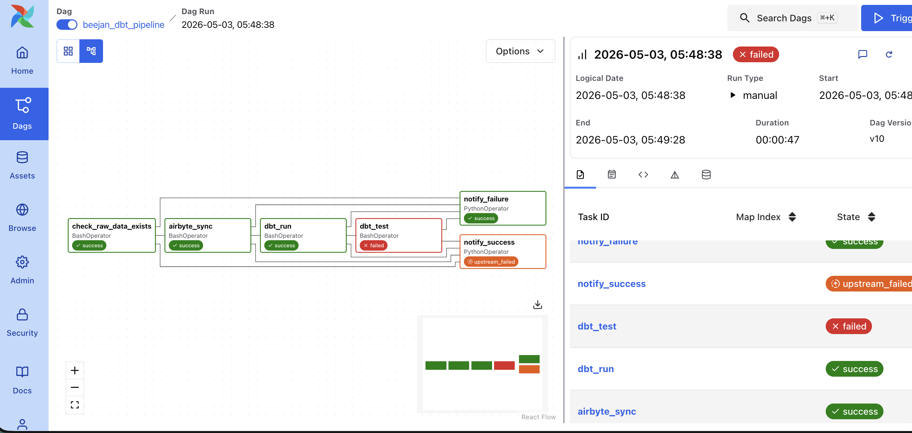
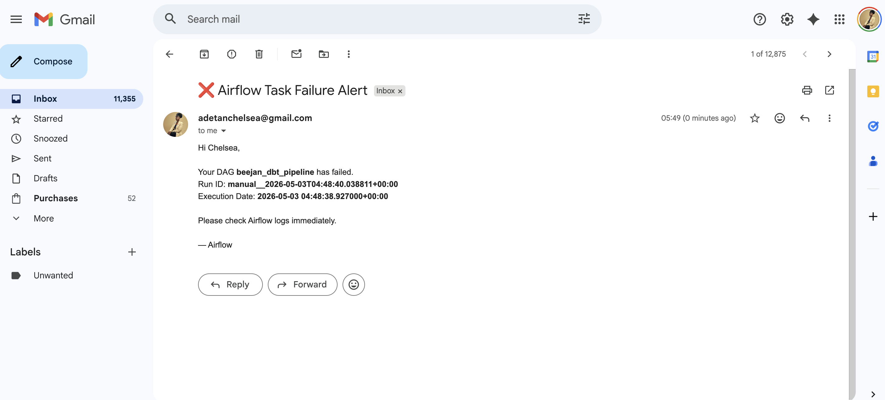
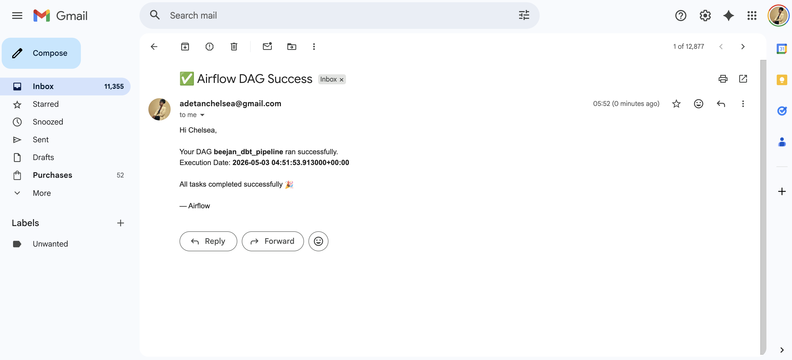
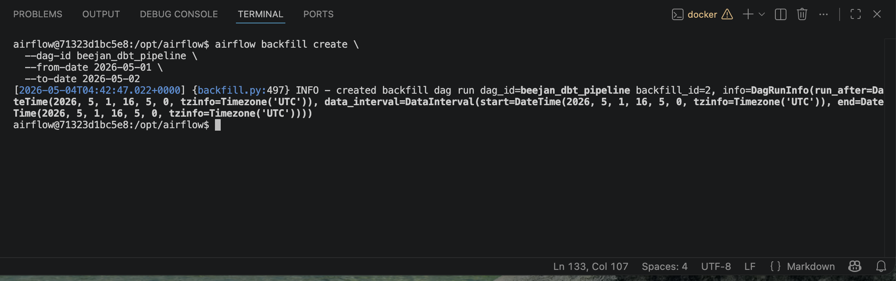

# BeejanRide Analytics Platform with dbt (Orchestrated with Airflow)

A production-grade analytics platform built for Beejan Rides, a UK mobility startup operating across five cities. This project transforms raw transactional data—such as rides, drivers, riders, payments, and city data—into clean, analytics-ready datasets, while ensuring the entire pipeline runs automatically, reliably, and without manual intervention.

The platform evolves beyond a simple transformation pipeline by introducing orchestration using Apache Airflow, making it suitable for real-world production environments.

---
## Table of Contents
- [Overview](#overview)  
- [Project Highlights](#project-highlights)  
- [Features](#features)  
- [Architecture & Data Flow](#architecture--data-flow)  
  - [Architecture Diagram (Updated with Airflow)](#architecture-diagram-updated-with-airflow)  
  - [Entity Relationship Diagram (ERD)](#entity-relationship-diagram-erd)  
  - [Data Lineage](#data-lineage)  
  - [Data Flow Explanation](#data-flow-explanation)  
- [Orchestration Layer (Airflow)](#orchestration-layer-airflow)  
  - [DAG Workflow](#dag-workflow)  
  - [What Airflow Handles](#what-airflow-handles)  
  - [Orchestration Evidence & Monitoring](#orchestration-evidence--monitoring)  
- [Technologies Used](#technologies-used)  
- [Project Setup](#project-setup)  
  - [Prerequisites](#prerequisites)  
  - [Installation](#installation)  
- [How It Works](#how-it-works)  
- [Sample Analytical Queries](#sample-analytical-queries)  
  - [Daily Revenue Dashboard](#daily-revenue-dashboard)  
  - [Rider LTV Analysis](#rider-ltv-analysis)  
  - [Fraud Monitoring](#fraud-monitoring)  
- [Design Decisions & Tradeoffs](#design-decisions--tradeoffs)  
- [Future Enhancements](#future-enhancements)  
- [Useful Resources](#useful-resources)  

---
## **Overview**

This project implements an end-to-end ELT pipeline that is both scalable and production-ready.
Raw data is first ingested from PostgreSQL using Airbyte, then stored in BigQuery. From there, transformations are handled by dbt, which structures the data into meaningful analytical layers. Airflow orchestrates the entire workflow—ensuring that ingestion, transformation, and validation happen in the correct order, on a defined schedule, and with built-in failure handling. In summary, the project:

- Ingests raw transactional data from Postgres via Airbyte.  
- Cleans, deduplicates, and standardizes data in **staging layer**.  
- Computes metrics in **intermediate layer**.  
- Stores data in **fact and dimension tables** in **marts layer**.  

Supports:  
- Daily revenue per city  
- Corporate vs personal revenue split  
- Driver performance & leaderboard  
- Rider lifetime value (LTV)  
- Payment reliability & fraud monitoring  

---

## **Project Highlights**  

- End-to-end ELT pipeline with automated orchestration  
- Production-grade workflow using Apache Airflow  
- Scalable data modeling with dbt (incremental + snapshots)  
- Built-in data quality testing and monitoring  
- Real-world failure handling, retries, and alerting  

---

## **Features**

- Raw → Staging → Intermediate → Marts layered approach
- Automated orchestration using Apache Airflow
- Airbyte ingestion from PostgreSQL to BigQuery
- dbt snapshots for **driver SCD Type 2** (status, vehicle, rating)
- Incremental models for high-volume tables
- dbt tests for data quality
- Failure handling with retries and email alerting
- Scheduled pipeline execution (no manual triggers)
- Backfill support for historical data processing
- Documentation & lineage generation via `dbt docs`
- Analytical queries ready for intelligence dashboards 

---
## **Architecture & Data Flow**

### **Architecture Diagram (Updated with Airflow)**


- **Raw Layer**: Ingested via Airbyte  
- **Staging Layer**: Cleans & deduplicates raw tables  
- **Intermediate Layer**: Computes reusable metrics & fraud flags  
- **Marts Layer**: Creates fact & dimension tables for dashboards  
- **Orchestration Layer**: Airflow coordinates all processes

### **Entity Relationship Diagram (ERD)**
  

### **Data Lineage**
  

### **Data Flow Explanation**

1. **Airbyte ingestion**: postgres → bigquery raw tables  
2. **Staging models**: rename columns, cast data types, standardize timestamps, remove duplicates  
3. **Intermediate models**: calculate key metrics like `trip_duration_minutes`, `net_revenue`, `rider_lifetime_value`  
4. **Marts layer**: ready-to-use fact & dimension tables for BI dashboards  
5. **Snapshots**: track driver changes for SCD Type 2  
6. **dbt docs**: generates lineage & documentation  
7. **Orchestration Layer**: Airflow coordinates all processes

---
### **Orchestration Layer (Airflow)**

The orchestration layer is implemented using Apache Airflow, which acts as the central control system for the pipeline. Instead of manually running ingestion and transformation steps, Airflow defines a Directed Acyclic Graph (DAG) that controls execution order, scheduling, and dependencies.

#### DAG Workflow
```bash
check_data >> ingestion >> dbt_run >> dbt_test 

[check_data, ingestion, dbt_run, dbt_test] >> notify_failure
[check_data, ingestion, dbt_run, dbt_test] >> notify_success
```

Each step only runs if the previous one succeeds, ensuring data consistency.

#### What Airflow Handles

1. Scheduling
The pipeline runs automatically based on a cron schedule. This removes the need for manual execution and ensures data is always up-to-date.

2. Task Dependencies
Airflow enforces strict execution order. For example, dbt transformations cannot run until ingestion completes successfully. This prevents incomplete or inconsistent data from entering the system.

3. Failure Handling & Retries
If a task fails, Airflow automatically retries it twice (2) based on predefined rules set in the dag file. If it still fails, the pipeline stops to prevent bad data from propagating.

4. Monitoring  
In the Airflow UI, DAG runs can be monitored through the Grid and Graph views, where task statuses, execution logs, retries, and run durations are displayed. Monitoring enables you to do the following:
- Track DAG run status (success/failure)  
- View task-level logs  
- Debug failures in real time  
- Monitor retries and execution duration  

This ensures full visibility into pipeline health.

5. Backfills
Backfill runs demonstrate the ability to process historical data using Airflow’s backfill functionality. This ensures that missed pipeline runs or historical data gaps can be reliably recovered without manual intervention.

6. Idempotency
The pipeline is designed so that rerunning tasks does not create duplicate or inconsistent data. This is achieved using incremental models and deduplication logic.
    - dbt incremental models ensure only new or updated records are processed  
    - Staging layer applies deduplication logic on raw ingested data  
    - Airbyte sync operates in append mode with downstream safeguards  
    - Airflow retries do not introduce duplicate data due to transformation logic  
This ensures the pipeline remains reliable even under retries, failures, or backfills.

#### Orchestration Evidence & Monitoring
To demonstrate that the pipeline is truly production-ready, multiple execution scenarios were tested and documented.
- **Successful DAG Run**
This shows a complete pipeline execution where all tasks succeeded. It confirms that ingestion, transformation, and testing are correctly connected and functioning and an email notification is triggered.

  

- **Failed DAG Run**
A failure was intentionally triggered to test the system’s robustness. When a task fails, downstream tasks do not execute, preserving data integrity and an email notification is triggered.

  

- **Email Alerting**
On failure, an automated email notification is sent. This ensures that issues are detected immediately without needing to monitor the UI constantly. An email notification is also sent on success.

  

  

- **Backfill Execution**
Backfill runs demonstrate the ability to process historical data. This is crucial for recovering from downtime or rebuilding datasets.

  

---

## **Technologies Used**

- **PostgreSQL** – Source transactional database
- **dbt Core** – Transformations 
- **BigQuery** – Cloud data warehouse  
- **Airbyte** – ETL ingestion from Postgres  
- **Git & GitHub** – Version control  
- **Apache Airflow** - Workflow Orchestration

---
## **Project Setup**

### **Prerequisites**

- BigQuery account and dataset  
- Airbyte configured for ingestion  
- Python 3.11  
- dbt installed  

### **Installation**
Follow these steps to set up the Beejan Rides analytics project on your local machine:

1. Clone the Repository
```bash
git clone https://github.com/adetanchelsea/beejanrides_analytics.git
cd beejanrides_analytics
```
This will copy all models, snapshots, macros, analyses, and documentation to your local machine.

2. Create and activate a virtual environment
```bash
python -m venv venv && source venv/bin/activate    # Mac/Linux
venv\Scripts\activate # Windows
```

3. Install dbt and dependencies
```bash
pip install dbt-core dbt-bigquery
dbt deps
```
4. Configure environment variables: Create a .env file in the project root
```bash
BIGQUERY_PROJECT=your_project_id
BIGQUERY_DATASET=dbt_dataset
BIGQUERY_KEYFILE=path/to/service-account.json
```

5. Configure your dbt profile: Create a profiles.yml file in .dbt
```yaml
beejan_rides:
  target: dev
  outputs:
    dev:
      type: bigquery
      method: service-account
      project: your_project_id
      dataset: dbt_dataset
      keyfile: path/to/service-account.json
      threads: 4
```

6. Run the pipeline
```bash
dbt run
dbt test
dbt docs generate
dbt docs serve
```
This will build all staging, intermediate, and marts models and generate the dbt documentation and lineage graph.

## How It Works  
1. Data Ingestion via Airbyte: Airbyte pulls data from Postgres (raw transactional data) and loads it into BigQuery for further processing.

2. Staging Layer: Cleans, deduplicates, and standardizes raw data (e.g., renaming columns, casting timestamps) to prepare for analysis.

3. Intermediate Layer: Computes key metrics and flags, such as fraud detection, extreme surge multipliers, and failed payments for deeper insights.

4. Marts Layer: Creates fact and dimension tables, structured in a star schema, for use in dashboards and analytical queries.

5. Snapshots: Tracks SCD Type 2 changes (e.g., driver status updates) to maintain historical accuracy.

6. Testing & Documentation: Implements dbt tests (data validation), and generates dbt docs for model lineage and governance.

## Sample Analytical Queries  
### Daily Revenue Dashboard
```sql
select
    date(t.pickup_at) as trip_date,
    c.city_name,
    count(t.trip_id) as total_trips,
    sum(t.actual_fare) as gross_revenue,
    sum(t.net_revenue) as net_revenue,
    avg(t.actual_fare) as avg_trip_fare

from {{ ref('trips_fact') }} as t
left join {{ ref('cities_dim') }} as c
    on t.city_id = c.city_id

group by
    date(t.pickup_at),
    c.city_name

order by
    trip_date,
    c.city_name
```
### Rider LTV Analysis
```sql
select

r.rider_id,

min(t.pickup_at) as first_trip_date,

max(t.pickup_at) as last_trip_date,

count(t.trip_id) as lifetime_trips,

sum(t.net_revenue) as lifetime_value,

avg(t.actual_fare) as avg_trip_value,

date_diff(max(t.pickup_at), min(t.pickup_at), day) as rider_lifespan_days

from {{ ref('trips_fact') }} t
left join {{ ref('riders_dim') }} r
on t.rider_id = r.rider_id

group by
r.rider_id

order by
lifetime_value desc
```

### Fraud Monitoring
```sql
select

trip_id,

driver_id,

rider_id,

city_id,

surge_multiplier,

actual_fare,

extreme_surge_multiplier,

failed_payment_on_completed_trip,

case

when extreme_surge_multiplier = 1
then 'Extreme Surge Pricing'

when failed_payment_on_completed_trip = 1
then 'Failed Payment on Completed Trip'

else 'Normal'

end as fraud_flag

from {{ ref('trips_fact') }}

where

extreme_surge_multiplier = 1
or failed_payment_on_completed_trip = 1
```

## Design Decisions & Tradeoffs  
1. Layered architecture: Easier maintenance, testing, and modularity.

2. dbt snapshots: Track historical changes without rewriting entire tables.

3. Incremental models: Faster runs for high-volume tables.

### Tradeoffs:

Incremental Append Sync Mode

Pros:

1. Efficient: Only new or updated data is processed, reducing execution time and costs.

2. Cost-Effective: Minimizes data processed, saving on BigQuery query costs.

3. Scalable: Handles large datasets effectively without performance hits.

Cons:

1. Complex: Requires additional logic to handle missing or historic data.

2. Data Consistency: Must ensure incremental logic prevents duplicates or outdated records.

## Future Enhancements  

1. Integrate predictive models for driver churn and fraud detection to enhance decision-making with machine learning insights.

2. Connect the BigQuery data warehouse to Tableau or Looker Studio for real-time, interactive business intelligence dashboards.

## Useful Resources  
- [dbt documentation](https://docs.getdbt.com/)
- [Airbyte documentation](https://docs.airbyte.com/)
- [Create a Data Modelling Pipeline](https://youtu.be/Nro18RmwE6E?si=iuhcJsaFDDPonMQA)

